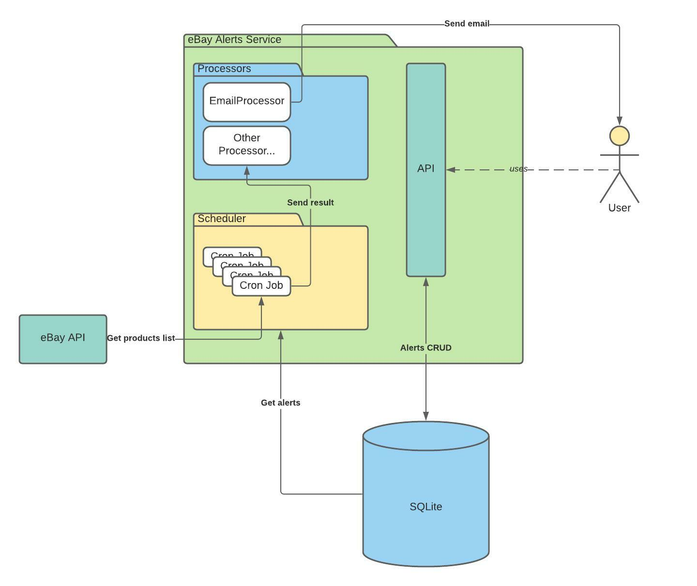

# EBAY ALERTS API

App which expose API for easy management of alerts for eBay products searches

## TODO

- [ ] eBay REST API calls to the Browse API to get 20 items with given search phrase and sort by price
- [ ] processor to get results from the scheduler and send message to the target email

Both of this tasks are pretty straightforward and I don't expect any problems here. 
But since eBay don't accept my registration on their dev portal (since then it's on the pending state) I didn't fulfill this
requirements. Anyway, this shouldn't be hard and I hope you can get an idea of my coding skills and style from existing code.

### Notes regarding Phase 2 of the assignment

Since we need to add some kind of analytical view for items, which we've got from the API, we could extend our data model to
keep some metrics regarding products. There could be some kind of connection between alert (probably by `alert id`) and e. g.
we could keep the cheapest product here and if it's changed - send additional email to the user with insight.


## Architecture overview



## Prerequisites
Docker

## Setup

Fill correct environment variables listed in the `.docker_env`

Build image and initiate db
```bash
docker-compose run alerts init_db
```

Run server
```bash
docker-compose up
```

By default server will be available on `localhost:8000`

## List of available environment variables

| Name                | Description                      | Required | Default            |
|---------------------|----------------------------------|----------|--------------------|
| APP_EBAY_API_KEY    | API key to access eBay API       | Yes      | None               |
| APP_EBAY_API_URL    | URL for eBay API                 | Yes      | None               |
| APP_LOG_LEVEL       | Application log level            | No       | `INFO`             |
| APP_DB_PATH         | Path to the application database | No       | `./data/db.sqlite` |
| APP_REQUEST_TIMEOUT | Timeout for external requests    | No       | 10                 |

## API Reference

API reference available [here](http://localhost:8000/docs). You should have application up and running to access it.

You could use this page as your REST client and try every single request.

## Testing

#### Prerequisites

Python >= 3.8

#### Install dev dependencies

```bash
pip install -r requirements/dev.txt
```

#### Run tests

```bash
pytest
```
